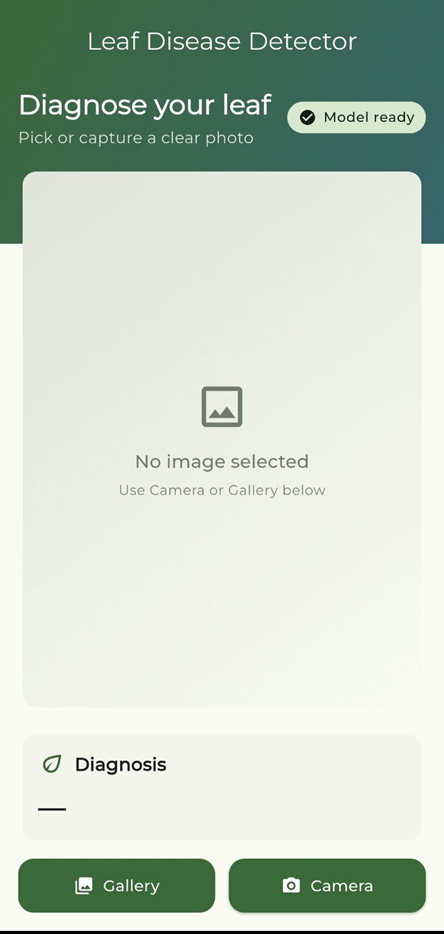
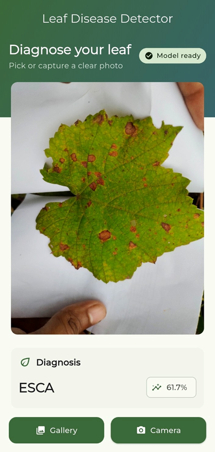

# Leaf Disease Detection App (Flutter)

An on-device Flutter app that classifies leaf diseases from an image using a TensorFlow Lite model.

## Features

- Pick an image from **Gallery** or capture from **Camera**
- Runs inference **offline/on-device** using `tflite_flutter`
- Shows the **top prediction** and a **confidence score**
- Includes a simple "leaf-likeness" check (green-ish heuristic) to reduce obvious non-leaf inputs

## Model & Assets

The app loads the model and labels from Flutter assets:

- `assets/leaf_disease_efficientnetb0.tflite`
- `assets/labels.txt`


## Requirements

- Flutter SDK (project is compatible with Flutter 3.x; tested with Flutter 3.35)
- Android Studio / VSCode

Note: This project uses `dart:io` for temporary files, so it is not set up to run on Flutter Web.

## Run Locally

```bash
flutter pub get
flutter run
```

## Build an APK Locally (Android)

```bash
flutter build apk --release
```

The output APK is typically located at:

`build/app/outputs/flutter-apk/app-release.apk`

## Download / Release APK from GitHub

This repo includes a GitHub Actions workflow that can build a **release APK** and make it downloadable:

- **Actions artifact**: each run uploads `app-release.apk` as an artifact
- **GitHub Release asset**: pushing a tag like `v1.0.0` creates a GitHub Release and attaches the APK

Create a release by pushing a tag:

```bash
git tag v1.0.0
git push origin v1.0.0
```

For signing setup (keystore + GitHub secrets), see `RELEASE.md`.

## Permissions

The app requests runtime permissions when needed:

- Camera access (for taking photos)
- Photos/Storage access (for selecting from gallery)

If permissions are permanently denied, the app will prompt opening the system app settings.

## Screenshots

<p align="center">
	
	
</p>